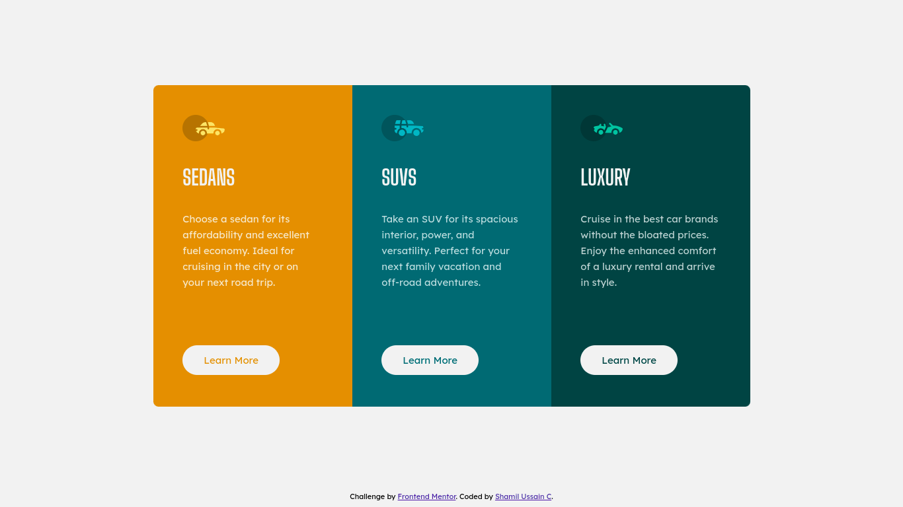

# Frontend Mentor - 3-column preview card component solution

This is a solution to the [3-column preview card component challenge on Frontend Mentor](https://www.frontendmentor.io/challenges/3column-preview-card-component-pH92eAR2-). Frontend Mentor challenges help you improve your coding skills by building realistic projects. 

## Table of contents

- [Overview](#overview)
  - [The challenge](#the-challenge)
  - [Screenshot](#screenshot)
  - [Links](#links)
- [My process](#my-process)
  - [Built with](#built-with)
- [Author](#author)

## Overview

Here is my 5th Frontend Mentor project. A responsive preview card component with 3 columns.

### The challenge

Users should be able to:

- View the optimal layout depending on their device's screen size
- See hover states for interactive elements

### Screenshot

### Links

- Solution URL: [https://www.frontendmentor.io/solutions/responsive-preview-card-component-using-flexbox-B1ERGaufq](https://www.frontendmentor.io/solutions/responsive-preview-card-component-using-flexbox-B1ERGaufq)
- Live Site URL: [https://shamilussainc.github.io/3-Column-Preview-Card-Component/](https://shamilussainc.github.io/3-Column-Preview-Card-Component/)

## My process

- First developed html body structure
- Started building with mobile first approach
- Used Sass to create css file
- Used flexbox and media query for responsive layout.
- Implemented hover states

### Built with

- Semantic HTML5 markup
- CSS custom properties
- SASS/SCSS
- Flexbox
- Mobile-first workflow

## Author

- Linkedin - [Shamil ussain c](https://www.linkedin.com/in/shamil-ussain-c-893282187/)
- Frontend Mentor - [@shamilussainc](https://www.frontendmentor.io/profile/shamilussainc)
- Twitter - [@c_ussain](https://twitter.com/c_ussain)
